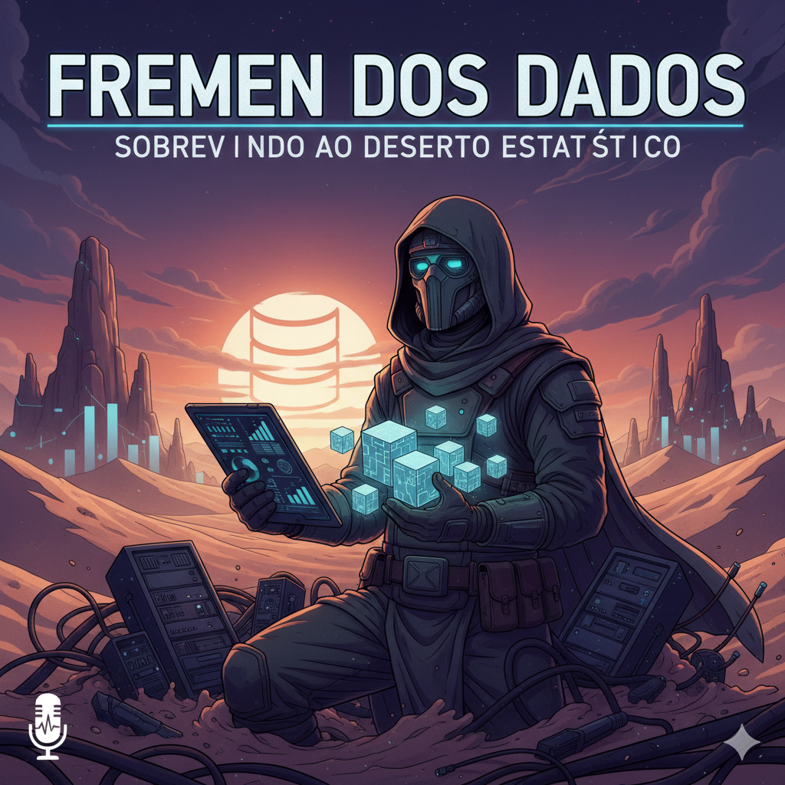

# **Fremen dos Dados: Criando um Podcast com Inteligência Artificial**

  

  🤖✨ Crie um podcast do zero usando Inteligência Artificial!

---

## **Sobre o Projeto**

A metodologia utilizada baseia-se em uma **esteira de prompts** cuidadosamente planejada, onde cada etapa do processo criativo foi conduzida por uma IA diferente.

---

## **📘 Leia o eBook**

  <a href="./output/fremen-dos-dados.pdf" download>
    📥 Fremen dos Dados – Conceitos Básicos (.pdf)
  </a>

---

## **💻 Tecnologias Utilizadas**

O projeto foi construído com o apoio de diversas ferramentas de IA e edição digital:

- **[ChatGPT](https://chat.openai.com/)** e **[Gemini](https://gemini.google.com/):** Geração de roteiros, ideias e estrutura narrativa.  
- **[ElevenLabs](https://beta.elevenlabs.io/):** Síntese de voz a partir do texto do roteiro.  
- **[CapCut](https://www.capcut.com/pt-br/):** Edição de áudio, trilha sonora e efeitos sonoros.  
- **[Midjourney](https://www.midjourney.com/):** Criação da arte de capa e identidade visual do podcast.  

---

## **✨ Como Foi Feito**

Cada parte do processo criativo foi conduzida com prompts otimizados para maximizar o potencial das IAs:

1. **Roteiro:** Gerado com o ChatGPT a partir de prompts estruturados para criar uma narrativa envolvente.  
2. **Áudio:** O texto foi convertido em voz sintética pela ElevenLabs.  
3. **Edição:** O áudio foi aprimorado no CapCut, com inserção de trilha sonora, sons ambientes e efeitos.  
4. **Arte de Capa:** Criada no Midjourney, garantindo uma identidade visual única para o projeto.  

---

## **📚 Materiais de Apoio**

- 🎥 [**Live no YouTube**](https://www.youtube.com): Assista ao passo a passo completo.  
- 🧭 [**Template no Notion**](https://helpful-jump-17b.notion.site/PAS-Podcast-AI-Studio-210489e15d7a4a73b743bb159e45d06f?pvs=4): Guia completo com prompts, estrutura e instruções detalhadas.  

---

## **🛠️ Como Reproduzir o Projeto**

Siga o fluxo de trabalho descrito no **Template do Notion** para criar o seu próprio podcast com IA:

1. **Roteiro:** Utilize os prompts de roteiro no ChatGPT ou Gemini.  
2. **Voz:** Converta o texto em áudio usando a ElevenLabs.  
3. **Edição:** Finalize o episódio com trilha e efeitos no CapCut.  
4. **Arte:** Crie a identidade visual com prompts no Midjourney.  

---

## **👨‍💻 Autor**

  

  <a href="https://github.com/Cleyton-Nobre">GitHub</a>
  &nbsp;|&nbsp;
  <a href="https://www.linkedin.com/in/cleyton-nobre/">LinkedIn</a>

---

## **Conclusão**

O projeto **Fremen dos Dados** demonstra como a colaboração entre humanos e inteligências artificiais pode transformar o processo criativo.  
Com as ferramentas certas e uma metodologia bem definida, é possível **criar conteúdo de alta qualidade, com identidade e propósito, de forma acessível e inovadora**.
